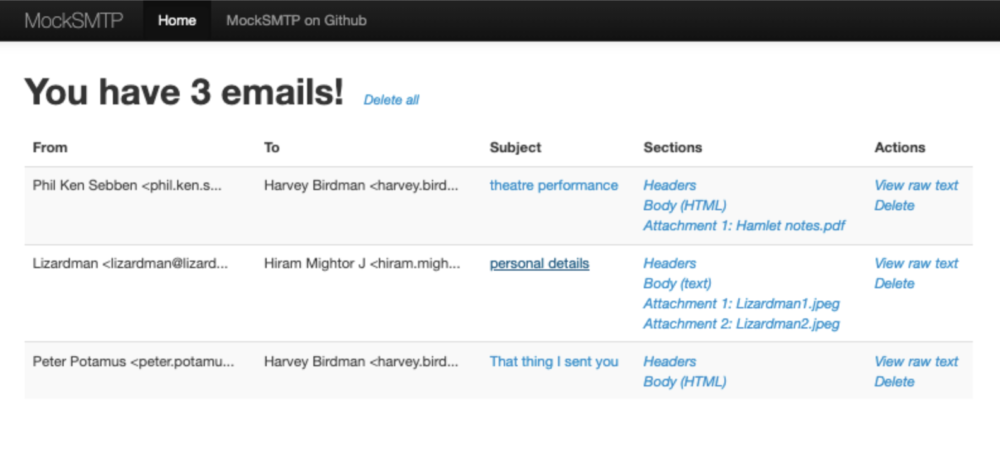
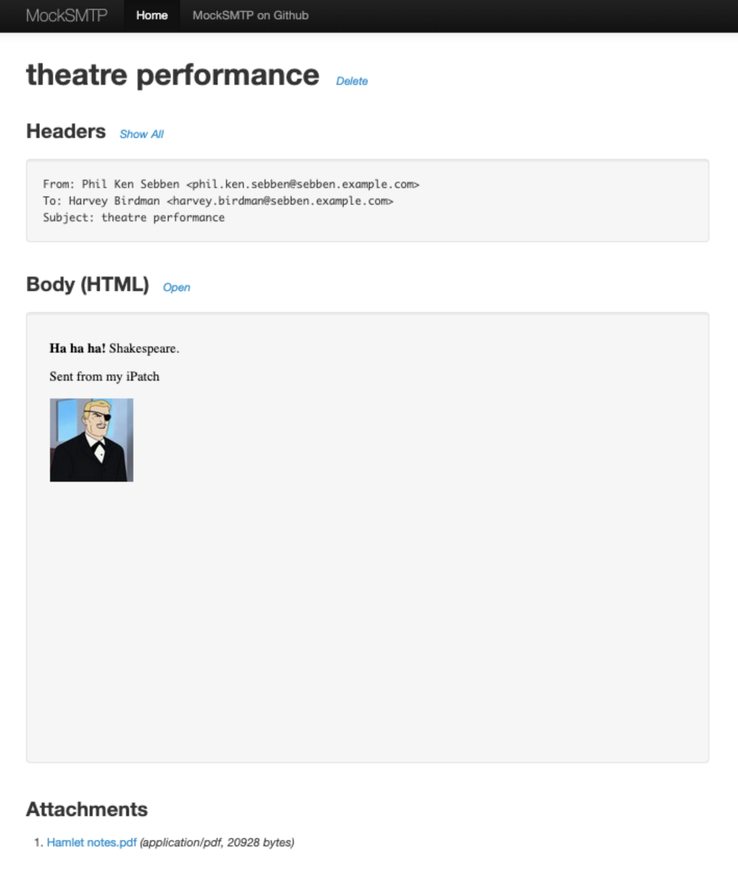

# MockSMTP - a mock SMTP server (obviously)

## Overview

MockSMTP is cross-platform testing tool that provides an outgoing email server without sending any outgoing email.

As a testing tool, MockSMTP provides an SMTP server to which an application under test can send email messages.
However, MockSMTP has no facility to send the messages:
instead, testers can use the MockSMTP web interface to view those messages in a sandboxed environment,
safe in the knowledge that the email messages can never reach real users by accident.

It was inspired by [MockMock](https://github.com/tweakers/MockMock), which was archived in 2024.

MockSMTP is written entirely in Java and is distributed freely under the [Apache License 2.0](LICENSE).

## Screenshots

The default page shows a list of the emails received by MockSMTP, in reverse chronological order:

From here, the user can view individual components of the message - such as its headers, body, or attachments -
or download the entire message as a raw `.eml` file.

Clicking on the subject of a message displays a summary of the message:

## Requirements

MockSMTP is built using Java 8 or later, so it can be run on any system with a Java 8 runtime environment,
such as Windows, macOS, and most Unix and Linux systems.

If you would like to build this application from its source code,
you will also need [Apache Maven 3.0 or later](https://maven.apache.org).

## Installation / Setup

The easiest way to install and run MockSMTP is to [download the MockSMTP.jar file](release/MockSMTP.jar) (right-click and "Save Target As").

To start the application, simply run the MockSMTP JAR file from the command line:
* To start with default settings: `java -jar /path/to/MockSMTP.jar`
* To start with default setting and included demo data: `java -jar /path/to/MockSMTP.jar --demo`
* To show other command line options: `java -jar /path/to/MockSMTP.jar --help`

By default, the application listens for SMTP connections on port 25, and HTTP connections on port 8282.
To open the web UI, simply open [http://localhost:8282] in a web browser.

There are a number of other command-line parameters available, including:

| Option                                             | Description                                                                   | Default Value                |
|----------------------------------------------------|-------------------------------------------------------------------------------|------------------------------|
| `-p` *port*   `--smtp-port-`*port*              | Sets the SMTP server port                                                     | 25                           |
| `-h` *port*   `--http-port=`*port*              | Sets the HTTP server port                                                     | 8282                         |
| `-m` *size*   `--max-queue-size=`*size*         | Limits the number of messages to be displayed                                 | 0 (unlimited)                |
| `-ff` *addresses*   `--filter-from=`*addresses* | Discards messages sent from certain addresses (single comma-separated string) | (empty, accept all messages) |
| `-ft` *addresses*   `--filter-to=`*addresses*   | Discards messages sent to certain addresses (single comma-separated string)   | (empty, accept all messages) |
| `--demo`                                           | Starts the application with demo data loaded                                  | false                        |
| `-?`   `--help`                                 | Shows command-line usage and exits                                            |                              |

### Building from source

If you would like to build this application from its source code,
you will also need [Apache Maven 3.0 or later](https://maven.apache.org).

To build the executable JAR file, run `mvn package`.
This generates the `target/MockSMTP-<version>-jar-with-dependencies.jar` file from which the application can be run.
(For convenience, this is also included in releases as `release/MockSMTP.jar`.)
Everything is contained within the JAR file, so you can copy this file to a convenient path and run it directly from there.

### Running as a Daemon

The package contains an `extra/init.ubuntu` file which you can use on Debian based systems:

1. Copy this file into the daemon folder, e.g. `cp extra/init.ubuntu /etc/init.d/mocksmtp`
2. Edit the new file and make sure the paths in there are correct. By default, the JAR would be stored as `/opt/mocksmtp/MockSMTP.jar`.
3. Ensure that the new file has execute permissions, e.g. `chmod +x /etc/init.d/mocksmtp`

You can now start MockSMTP as a daemon by running `/etc/init.d/mocksmtp start`.

## Web UI

Any messages that MockSMTP receives will be listed in the Web UI, available by default at [http://localhost:8282/].

The paths available in the Web UI are as follows:

| URL path                                       | Description                                       | Response Content Type       |
|------------------------------------------------|---------------------------------------------------|-----------------------------|
| `/`                                            | Shows the Mail List View for the given message    | `text/html`                 |
| `/view/:mailIndex`                             | Shows the Mail Summary View for the given message | `text/html`                 |
| `/view/:mailIndex/headers`                     | Shows the headers for the given message           | `text/plain`                |
| `/view/:mailIndex/body`                        | Shows the message body for the given message      | `text/plain` or `text/html` |
| `/view/:mailIndex/attachment/:attachmentIndex` | Shows the given attachment for the given message  | (attachment content type)   |
| `/view/:mailIndex/raw`                         | Shows the entire message as raw text              | `text/plain`                |
| `/delete/:mailIndex`                           | Delete the given message                          | Redirects to `/`            |
| `/delete/all`                                  | Deletes all messages                              | Redirects to `/`            |

Mail messages are indexed via positive integers, with a `:mailIndex` of 1 being the earliest message received in the queue, 2 being the second-earliest, and so on.
Mail indices can also be negative, where a `:mailIndex` of -1 represents the latest message received in the queue.
Note that as mail messages are added and deleted, the index of a given message may change.

Likewise, `:attachmentIndex` values are positive integers starting from 1.
